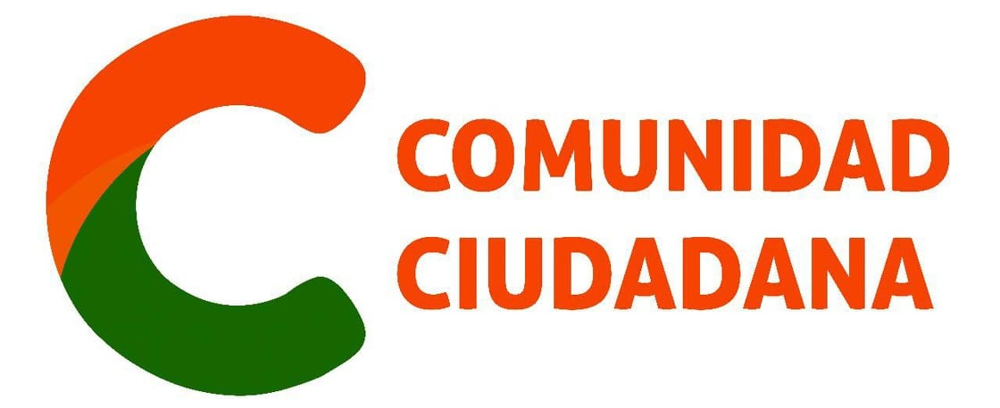
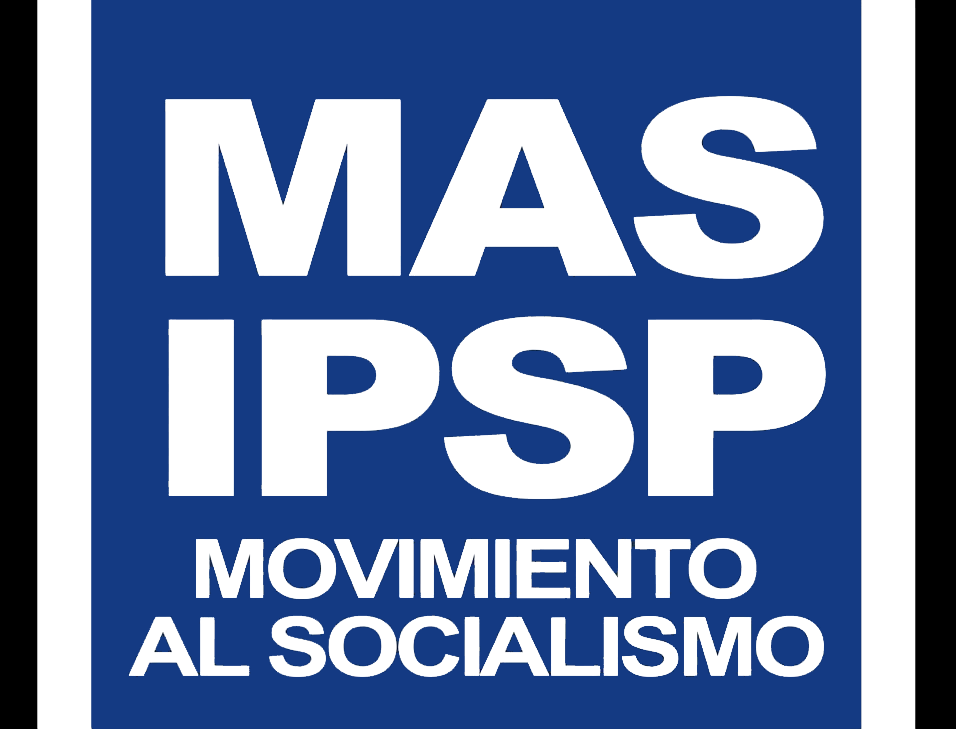
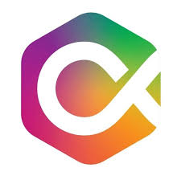
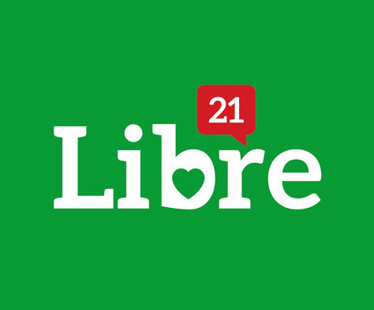

```{r setup, include=FALSE}
knitr::opts_knit$set(self.contained = T)
library(readr)
```


Resultados encuestas {data-icon="fa-chart-bar"}
=====================================  

Row {.tabset .tabset-fade}
-------------------------------------
### Voto válido: Resultados ponderados
<iframe frameBorder="0" src="img/tendencia_validos.html" width="100%" height="100%" allowtransparency="true"></iframe>

### Voto válido y no válido: Resultados ponderados
<iframe frameBorder="0" src="img/tendencia.html" width="100%" height="100%" allowtransparency="true"></iframe>

### Voto válido: Resultados sin ponderadar
<iframe frameBorder="0" src="img/scatter_validos.html" width="100%" height="100%" allowtransparency="true"></iframe>

### Voto válido y no válido: Resultados sin ponderar
<iframe frameBorder="0" src="img/scatter.html" width="100%" height="100%" allowtransparency="true"></iframe>

### Metodología 

<h3><b>Sobre resultados **con** ponderaciones</h3></b>

Considerando que en algunos meses se publican varias encuestas, la presente visualización realiza una síntesis numérica con base en promedios para las encuestas realizadas. Se toman dos criterios para generar promedios ponderados. En primer lugar, la cobertura de la muestra pretende asignar mayor peso a aquellas encuestas cuyo marco muestral cubre una mayor proporción del país (ej. capitales + ciudades intermedias + área rural > eje troncal). Este criterio representa 60% de la ponderación. En segundo lugar, para el 40% restante, se toman los tamaños de las muestras de cada encuesta, con el fin de asignarle un mayor peso a las que tienen un número elevado de personas encuestadas (ej. 2400 > 800).<br>
<br>
<br>

<b><h3>Sobre resultados **sin** ponderaciones</h3></b>

Las visualizaciones incluyen únicamente datos para las cuatro postulaciones con mayor intención de voto, dado que incluir líneas individuales para cada uno de los 13 candidatos (ya sea que su participación en las elecciones se concrete o no) dificulta la claridad en la representación gráfica de tendencias. 

En el caso de la postulación del MAS-IPSP, su candidatura a la presidencia no estaba definida y varias encuestadoras se refirieron a diferentes candidatos. Para facilitar la lectura de la tendencia, pusimos en la misma línea tanto la intención de voto por Andrónico Rodríguez (en los meses de noviembre y diciembre de las encuestas de Mercados y Muestras) como la de Luis Arce en general, ya sea anterior o posterior a su nombramiento oficial. 

En el caso de la encuesta de Celag, del mes de junio, esta institución solo publicó el voto válido. Con base en la información publicada se calculó el voto válido y no válido.

Si gusta consultar la base de datos con los resultados desagregados, incluyendo al resto de los candidatos, puede hacerlo en la sección “Base de datos” de esta misma página.

Para simplificar el análisis, hemos consolidado como “Voto no declarado” las categorías ”No sabe/No responde”, “Blanco”, “Ninguno”, “Nulo”, “No contesta”, “Indecisos”, “Voto secreto”, “Blanco/Nulo” y “Ninguno/Blanco/Nulo”.

En caso de que algún candidato no estuviese registrado en determinada encuesta, se completó este valor perdido con el valor más cercano. Por ejemplo, si la candidatura “x” fue computada para enero pero no para febrero, se repitió el valor de enero para febrero, con el fin de tener una proyección similar y comparable para todas las candidaturas.
<br>
<br>

<b><h3>Sobre el voto válido</h3></b>
Varias encuestadoras han difundido cifras sobre el voto válido, sin embargo, cada una tomó diferentes metodologías para realizar dicha proyección. Con fines metodológicos, hemos decido apegarnos a nuestro cálculo en el que se reparte proporcionalmente el “voto no declarado” entre todas las candidaturas.


Base de datos {data-icon="fa-database"}
=====================================  
Row {.tabset .tabset-fade}
-------------------------------------
### Base de datos
<br>
<br>
<br>
<br>
<br>
<br>
<center><h2>Acceda a la base de datos haciendo click en el ícono</h2></center><br>
<br>
<br>
<center><a href="https://docs.google.com/spreadsheets/d/15Mb5LFQWmPklB9dJA0dnRICieSoT3_G3xajOCDimBRs/edit#gid=624147339"><i class="fa fa-database fa-4x"></i></a></center>

### Fuentes de encuestas
<iframe frameBorder="0" src="img/tabla.html" width="100%" height="100%" allowtransparency="true"></iframe>

Padrón electoral {data-icon="fa-address-card"}
=====================================  


De acuerdo al calendario electoral [publicado por el Tribunal Supremo Electoral](https://www.oep.org.bo/wp-content/uploads/2020/01/Calendario_Electoral_EG_2020.pdf) el hito 46 en fecha 26 de marzo, corresponde a la entrega oficial del padrón electoral. 

Sea actualizará esta información una vez el padrón sea publicado. 

Programas de gobierno {data-icon="fa-book-open"}
=====================================  
Row {.tabset .tabset-fade}
-------------------------------------
### Programas de gobierno

<center>**Haga click en el logo de cada partido para acceder al programa de gobierno**</center>

<br>
<br>
<center><a href="https://www.oep.org.bo/wp-content/uploads/2020/02/Programa_Gobierno_ADN_EG_2020.pdf"></a></center>               

<br>

<center><a href="https://www.oep.org.bo/wp-content/uploads/2020/02/Programa_Gobierno_CC_EG_2020.pdf"></a></center>               

<br>

<center><a href="https://www.oep.org.bo/wp-content/uploads/2020/02/Programa_Gobierno_FPV_EG_2020.pdf"></a></center>      

<br>

<center><a href="https://www.oep.org.bo/wp-content/uploads/2020/02/Programa_Gobierno_PAN-BOL_EG_2020.pdf"></a></center>

<br>

<center><a href="https://www.oep.org.bo/wp-content/uploads/2020/02/Programa_Gobierno_MAS-IPSP_EG_2020.pdf"></a></center>

<br>

<center><a href="https://www.oep.org.bo/wp-content/uploads/2020/02/Programa_Gobierno_JUNTOS_EG_2020.pdf"></a></center>

<br>

<center><a href="https://www.oep.org.bo/wp-content/uploads/2020/02/Programa_Gobierno_CREEMOS_EG_2020.pdf"></a></center>

<br>

<center><a href="https://www.oep.org.bo/wp-content/uploads/2020/02/Programa_Gobierno_LIBRE-21_EG_2020.pdf"></a></center>


### Comparación de los programas en la prensa
<iframe frameBorder="0" src="img/planes_periodicos.html" width="100%" height="100%" allowtransparency="true"></iframe>

### Comparación de los programas por instituciones académicas y otras

- [Sociedad científica. Ciencias Políticas. Universidad Católica Boliviana San Pablo](http://gen.com.bo/sociedadcpo/proyectos) 


Sobre el proyecto {data-icon="fa-sticky-note"}
=====================================  
Esta iniciativa busca recopilar información relevante para el proceso electoral en Bolivia, de cara a las elecciones generales del 3 de mayo de 2020. 

En su primera fase, el proyecto reunió cifras de todas las encuestas electorales publicadas en Bolivia desde noviembre de 2016 hasta octubre del 2019, difundidas en más de 19 medios y producidas por 8 encuestadoras. Con base en la visualización y sistematización de más de 55 encuestas publicadas, el objetivo fue ofrecer insumos para analizar los resultados en su conjunto. Asimismo contamos con una visualización interactiva del padrón electoral, los programas de Gobierno y comparaciones de dichos programas, publicadas en la prensa y realizadas por diferentes instituciones. 

En su segunda fase, el proyecto busca dar continuidad al trabajo realizado para las elecciones 2019, siguiendo la misma metodología.

Los datos publicados pueden ser usados por terceros, siempre y cuando se cite la fuente: [www.boliviaelectoral.com](http://boliviaelectoral.com/)

El proyecto se realiza con apoyo de la [Fundación Friedrich Ebert (FES)](https://www.fes-bolivia.org/). Para mayor información comunicarse con info@fes-bolivia.org

<br>

